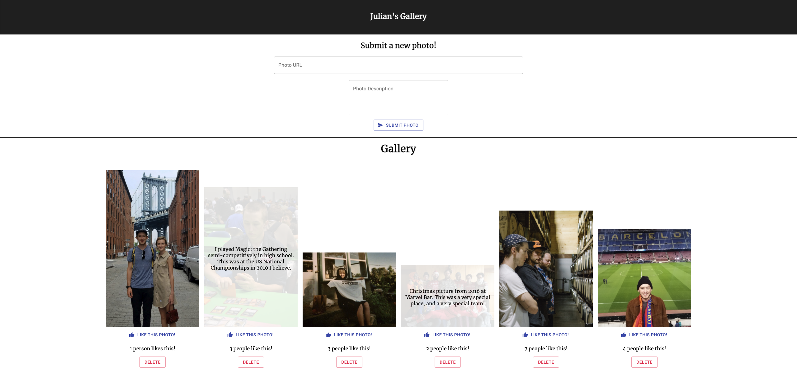

# React Image Gallery!

## Description

_Duration: Weekend_

Web app that allows the user to add images to a gallery with a description. When the image is clicked, the image opacity drops and the description is revealed over the image.

## Screen Shot

## Installation

To initialize the database, create a new database in your local/localhost route called "gallery-project". Inside of that database, using Postico or another SQL app, run the SQL queries provided in database.sql to get the initial table up and running with some test data.

Download the repository and [node.js](https://nodejs.org/en/download/) if you do not already have node.  With the folder open in your terminal, run 'npm install' inside the terminal window. Run 'npm run server' inside of this terminal window, and then open an additional terminal window inside the repository. Inside of this terminal window, run "npm run client".

## Usage

- Input fields at the top of the page allow the user to submit an image using a direct URL, as well as a description of the photo.
- Images are added to the database, and then rendered to the DOM.
- If the image is clicked, the photo will fade and text will pop up over it containing the description.
- Like button allows the user to 'like' photos. When a user hits the button, the 'like' counter will increment by 1.
- Delete button allows the user to delete photos from the gallery.
- Sweetalert-2 used to confirm if the user wants to delete an image.

## Built With

HTML, CSS, javascript, React, node, express, axios, postgresql, sweetalert2, material-ui.

## Acknowledgement
Thanks to [Prime Digital Academy](www.primeacademy.io) who equipped and helped me to make this application a reality.

